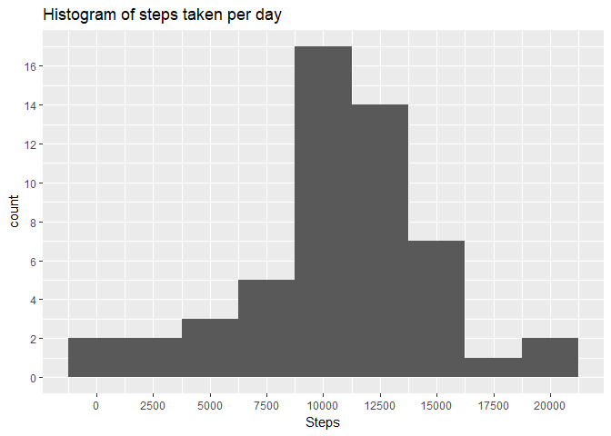
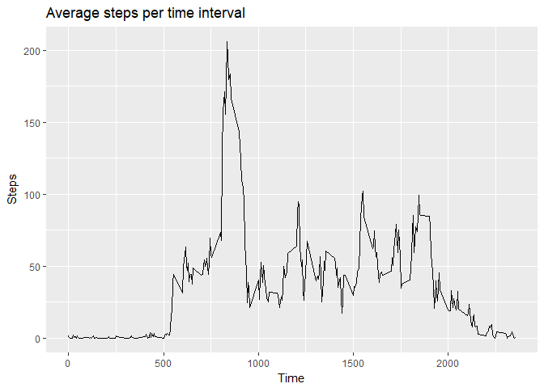
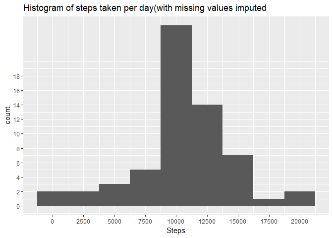
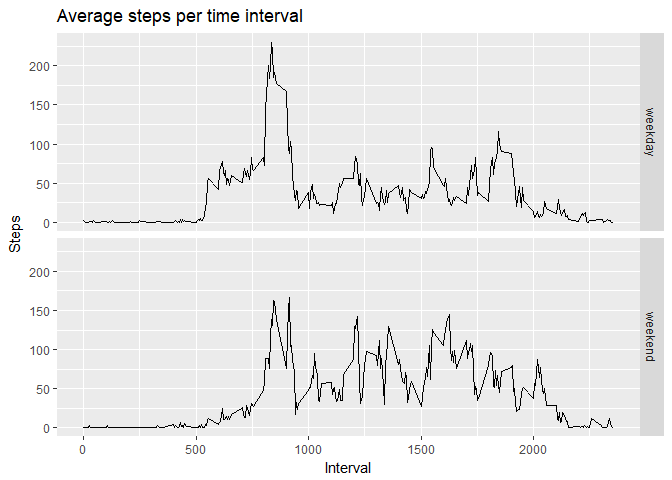

## Loading and preprocessing the data
Show any code that is needed to

1. Load the data (i.e. `read.csv()`)

2. Process/transform the data (if necessary) into a format suitable for your analysis

```r
act<-read.csv("C:/Data_Science/data/Reproducible research course project data/project 1/activity.csv")
act$date<-as.Date(act$date,format="%Y-%m-%d")
no_na<-subset(act,!is.na(act$steps))
library(ggplot2)
```

```
## Warning: package 'ggplot2' was built under R version 3.4.4
```

```r
library(dplyr)
```

```
## 
## Attaching package: 'dplyr'
```

```
## The following objects are masked from 'package:stats':
## 
##     filter, lag
```

```
## The following objects are masked from 'package:base':
## 
##     intersect, setdiff, setequal, union
```

```r
library(lubridate)
```

```
## Warning: package 'lubridate' was built under R version 3.4.4
```

```
## 
## Attaching package: 'lubridate'
```

```
## The following object is masked from 'package:base':
## 
##     date
```
## What is mean total number of steps taken per day?
For this part of the assignment, you can ignore the missing values in
the dataset.

1. Calculate the total number of steps taken per day

2. Make a histogram of the total number of steps taken each day

3. Calculate and report the **mean** and **median** total number of steps taken per day

```r
summ<-act%>%group_by(date)%>%summarise(datewise=sum(steps),na.rm=TRUE)
g<-ggplot(data=summ, aes(datewise))
g+geom_histogram(binwidth=2500)+ggtitle("Histogram of steps taken per day")+xlab("Steps")+
scale_x_continuous(breaks=seq(0,25000,2500))+scale_y_continuous(breaks=seq(0,18,2))
```

```
## Warning: Removed 8 rows containing non-finite values (stat_bin).
```

<!-- -->

```r
mean(summ$datewise,na.rm=TRUE)
```

```
## [1] 10766.19
```

```r
median(summ$datewise,na.rm=TRUE)
```

```
## [1] 10765
```
## What is the average daily activity pattern?
1. Make a time series plot (i.e. `type = "l"`) of the 5-minute interval (x-axis) and the average number of steps taken, averaged across all days (y-axis)

2. Which 5-minute interval, on average across all the days in the dataset, contains the maximum number of steps?

```r
stepavg<-act%>%group_by(interval)%>%summarise(avg=mean(steps,na.rm=TRUE))
g<-ggplot(stepavg,aes(interval,avg))
g+geom_line()+ggtitle("Average steps per time interval")+xlab("Time")+ylab("Steps")
```

<!-- -->

```r
summary(stepavg)
```

```
##     interval           avg         
##  Min.   :   0.0   Min.   :  0.000  
##  1st Qu.: 588.8   1st Qu.:  2.486  
##  Median :1177.5   Median : 34.113  
##  Mean   :1177.5   Mean   : 37.383  
##  3rd Qu.:1766.2   3rd Qu.: 52.835  
##  Max.   :2355.0   Max.   :206.170
```

```r
pos<-which(stepavg$avg==max(stepavg$avg))
stepavg[pos,]
```

```
## # A tibble: 1 x 2
##   interval   avg
##      <int> <dbl>
## 1      835  206.
```
## Imputing missing values
Note that there are a number of days/intervals where there are missing
values (coded as `NA`). The presence of missing days may introduce
bias into some calculations or summaries of the data.

1. Calculate and report the total number of missing values in the dataset (i.e. the total number of rows with `NA`s)

2. Devise a strategy for filling in all of the missing values in the dataset. The strategy does not need to be sophisticated. For example, you could use the mean/median for that day, or the mean for that 5-minute interval, etc.

3. Create a new dataset that is equal to the original dataset but with the missing data filled in.

4. Make a histogram of the total number of steps taken each day and Calculate and report the **mean** and **median** total number of steps taken per day. Do these values differ from the estimates from the first part of the assignment? What is the impact of imputing missing data on the estimates of the total daily number of steps?

```r
sum(is.na(act$steps))
```

```
## [1] 2304
```

So the original data set has 2304 rows with missing data.

We use a simple strategy for filling in all of the missing values in the dataset. If a 5-minute interval has missing value, we use the mean for that 5-minute interval.

We create a new data frame df_impute that is equal to the original dataset but with the missing data filled in (using mean for that interval for imputation):

```r
act_impute<-act
na_bool<-is.na(act_impute$steps)
int_avg<-tapply(no_na$steps,no_na$interval,mean,na.rm=TRUE,simplify=T)
act_impute$steps[na_bool] <- int_avg[as.character(act_impute$interval[na_bool])]
```


```r
summ<-act_impute%>%group_by(date)%>%summarise(datewise=sum(steps),na.rm=TRUE)
g<-ggplot(data=summ, aes(datewise))
g+geom_histogram(binwidth=2500)+ggtitle("Histogram of steps taken per day(with missing values imputed")+xlab("Steps")+scale_x_continuous(breaks=seq(0,25000,2500))+scale_y_continuous(breaks=seq(0,18,2))
```

<!-- -->

```r
mean(summ$datewise,na.rm=TRUE)
```

```
## [1] 10766.19
```

```r
median(summ$datewise,na.rm=TRUE)
```

```
## [1] 10766.19
```
## Are there differences in activity patterns between weekdays and weekends?
For this part the `weekdays()` function may be of some help here. Use
the dataset with the filled-in missing values for this part.

1. Create a new factor variable in the dataset with two levels -- "weekday" and "weekend" indicating whether a given date is a weekday or weekend day.

2. Make a panel plot containing a time series plot (i.e. `type = "l"`) of the 5-minute interval (x-axis) and the average number of steps taken, averaged across all weekday days or weekend days (y-axis). The plot should look something like the following, which was created using **simulated data**:

```r
act_impute$day<-weekdays(as.Date(act_impute$date))
act_impute$DayType<-ifelse(act_impute$day=='Saturday' | act_impute$day=='Sunday', 'weekend','weekday')
```


```r
grp<-act_impute%>%group_by(DayType,interval)%>%summarise(avg=mean(steps))
g<-ggplot(grp,aes(interval,avg))
g+geom_line()+ggtitle("Average steps per time interval")+xlab("Interval")+
ylab("Steps")+facet_grid(DayType~.)
```

<!-- -->
